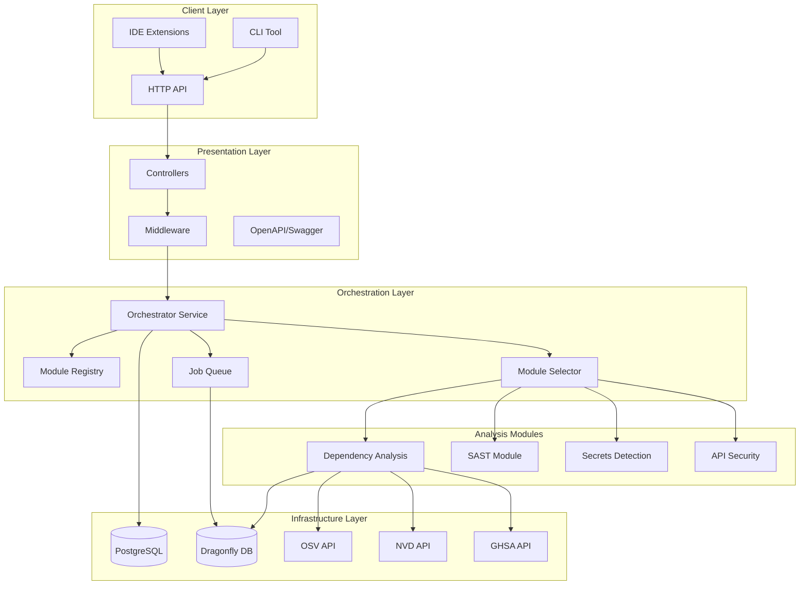

# System Overview

Vulnera is built with **Domain-Driven Design (DDD)** and a layered architecture optimized for security analysis at scale.

## Architecture Diagram



## Layered Architecture

### Domain Layer

Pure business logic with no external dependencies:

- **Entities** — Core business objects (Vulnerability, Package, Finding)
- **Value Objects** — Immutable values (Version, Severity, Ecosystem)
- **Traits** — Domain interfaces (AnalysisModule, VulnerabilitySource)

### Application Layer

Use cases and orchestration:

- **Use Cases** — Business operations (AnalyzeRepository, ScanDependencies)
- **Services** — Application services coordinating domain logic
- **DTOs** — Data transfer objects for layer boundaries

### Infrastructure Layer

External integrations and persistence:

- **Repositories** — Data access (PostgreSQL via SQLx)
- **API Clients** — External services (OSV, NVD, GHSA)
- **Cache** — Dragonfly DB for performance
- **Parsers** — Dependency file parsing

### Presentation Layer

HTTP API and user interfaces:

- **Controllers** — HTTP request handlers
- **Middleware** — Auth, rate limiting, logging
- **OpenAPI** — Auto-generated documentation

## Modular Architecture

### Module Registry

Centralized registry manages all analysis modules:

```rust
pub struct ModuleRegistry {
    modules: HashMap<ModuleType, Arc<dyn AnalysisModule>>,
}
```

### Rule-Based Selection

Automatically selects modules based on:

- Source type (git, directory, file)
- File patterns detected
- Analysis depth requested

### Unified API

Single endpoint for comprehensive analysis:

```
POST /api/v1/analyze/job
```

### Parallel Execution

Modules execute in parallel for optimal performance, respecting configured concurrency limits.

## Caching Strategy

### Two-Tier Cache

1. **L1 Cache** — In-memory, fast access
2. **L2 Cache** — Dragonfly DB, persistent

### Cache Keys

```
vulnera:vuln:{ecosystem}:{package}:{version}
vulnera:registry:{ecosystem}:{package}
vulnera:job:{job_id}
```

### TTL Configuration

```bash
VULNERA__CACHE__TTL_HOURS=24
```

## Concurrency Model

Built on Tokio async runtime:

```bash
# Concurrent package analysis
VULNERA__ANALYSIS__MAX_CONCURRENT_PACKAGES=3

# Concurrent registry queries
VULNERA__ANALYSIS__MAX_CONCURRENT_REGISTRY_QUERIES=5

# Concurrent API calls
VULNERA__ANALYSIS__MAX_CONCURRENT_API_CALLS=10
```

## Data Flow

```
Request → Auth Middleware → Rate Limiter → Controller
    ↓
Orchestrator → Module Selector → [Parallel Modules]
    ↓
Aggregator → Response
```

## Deployment Architecture

### Recommended Production Setup

```
┌─────────────────────────────────────────────────────────┐
│                    Load Balancer                         │
└─────────────────────────────────────────────────────────┘
                           │
           ┌───────────────┼───────────────┐
           ▼               ▼               ▼
    ┌──────────┐    ┌──────────┐    ┌──────────┐
    │ Vulnera  │    │ Vulnera  │    │ Vulnera  │
    │ Instance │    │ Instance │    │ Instance │
    └──────────┘    └──────────┘    └──────────┘
           │               │               │
           └───────────────┼───────────────┘
                           │
           ┌───────────────┼───────────────┐
           ▼               ▼               ▼
    ┌──────────┐    ┌──────────┐    ┌──────────┐
    │PostgreSQL│    │Dragonfly │    │ External │
    │ Primary  │    │  Cache   │    │   APIs   │
    └──────────┘    └──────────┘    └──────────┘
```

## Technology Stack

| Component | Technology |
|-----------|------------|
| Language | Rust 1.82+ |
| Runtime | Tokio (async) |
| Web Framework | Axum |
| Database | PostgreSQL + SQLx |
| Cache | Dragonfly DB |
| API Docs | utoipa + Swagger UI |
| Auth | JWT + bcrypt |
